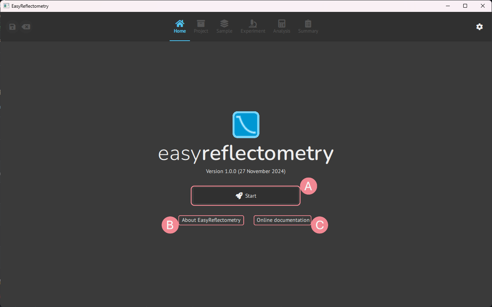
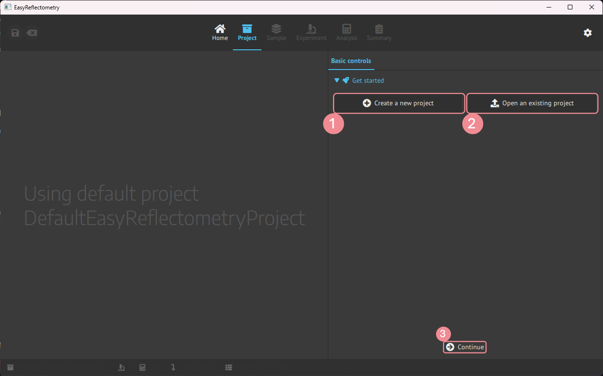
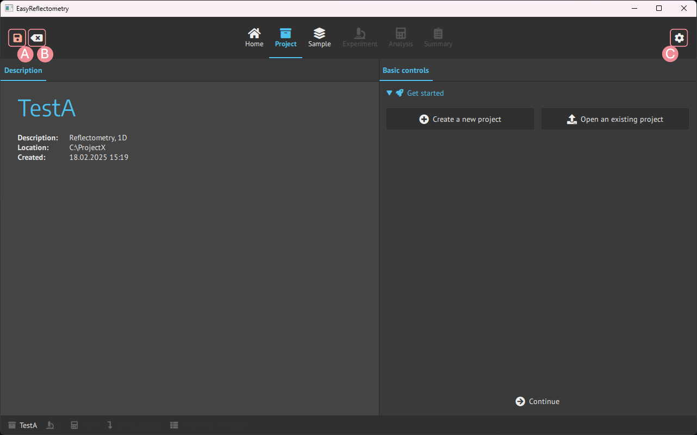

# Getting started
This is the tutorial for EasyReflectometryApp and how to use it.  
Version: 1.0.0 

## Home page
When opening up the EasyRecletometryApp you are presented with the **Home** page.  

- **A**: Starts your project.
- **B**: Pop-up window with source information.
- **C**: Link to developer documentation.

## Intialise project

Pressing **A** will direct you to the **Project** page.  

- **1**: Create a new project as a folder containing experiments and a JSON file for settings.
   - New projects need a name, description and set the save location.
- **2**: Opens a previous project from the JSON file.
- **3**: Continues to the next page, here it is **Model**.
    - This button is universal throughout the app and will always forward you to the next page.

If no project is selected/created a default project is initialised.  
This project is used going forward to explain the app.

## Save and settings
When a project is started two further buttons is visualised, and settings is the opposite corner of those.

- **A**: Save project.
- **B**: Reset to start.
- **C**: Setting, is further explained in settings.
