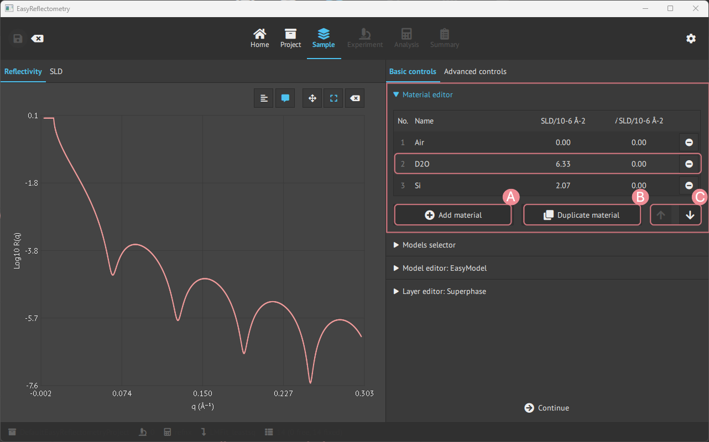
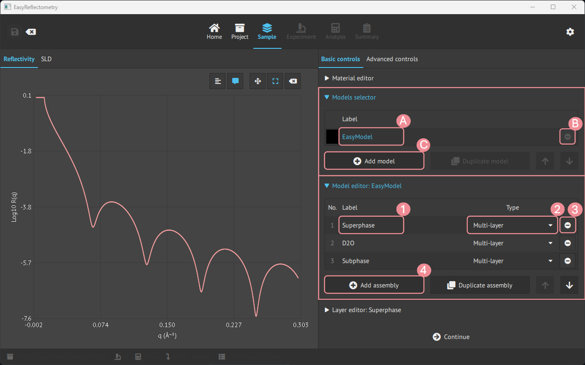
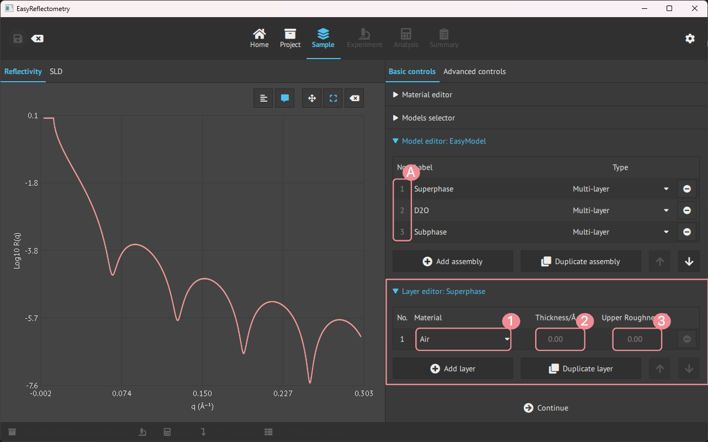

# Material and model setup
When a project is initialised it is then possible to define material and set the model.  

Let us first look at the general layout of the `Model` page, which is split up into two parts, the main window showing the graphs and the sidebar being the control panel for variables and data.

- **A**: Graph change between the Reflectivity- and Scattering Length Density (SLD) curve.
- **B**: Graph control of ledger, visible coordinates on hower, zoom and pan control, and reset.
- **C**: Basic controls, for defining material and model, and advanced controls for further setting parameters.

## Basic controls
### Material editor
To construct a model in the app, first, you add the materials that will compose the layers in `Material Editor`.  
The materials are added by the real and imaginary components of the scattering length density (in units of 10-6Å-2) and given a name for the material.  

- **A**: For adding more material.
- **B**: Duplicating the last clicked material.
- **C**: Changes the ordering of materials.

### Model creation and editing
For creating new models, the `Models selector` tab is used, and then for setting the assemblies in the model the `Model editor` is used.  

- **A**: Renaming model.
- **B**: Removing the specific model.
- **C**: Adding more models.
- **1**: Renaming/naming the assembly.
- **2**: Setting the type of assembly; Multilayer, Repeating Multilayer or Surfactant layer.
- **3**: Removing the specific assembly.
- **4**: Adding more asseblies.

### Layer editor
Then for editing the assemblies in the model, the `Layer editor` is used.  
By clicking an assembly, the `Layer editor` is specified and changes can be made to that assembly.

- **A**: Pick the desired assembly to modify.
- **1**: Choose a material from materials in the `Material Editor`.
- **2**+**3**: Setting the Thickness and Upper Roughness of the material in Angstrom, Å.

## Advanced controls
In the advanced controls, it is possible to apply a specific Q-range of interest and sample constraints on the model.

- **A**: Setting min. Q value of interest.
- **B**: Setting max. Q value of interest.
- **C**: Setting Q-resolution.  
- **D**: Set 1. dependent parameter.
- **E**: Set 2. dependent parameter.
- **F**: Set the mathematical operator (+,-,*,/) for **G** to apply to **E**.
- **G**: Numeric value to apply to **F**.
- **H**: Set the comparison operators (=,<,>) between **D** and **E**.
- **I**: Apply the sample constraint to the model.
