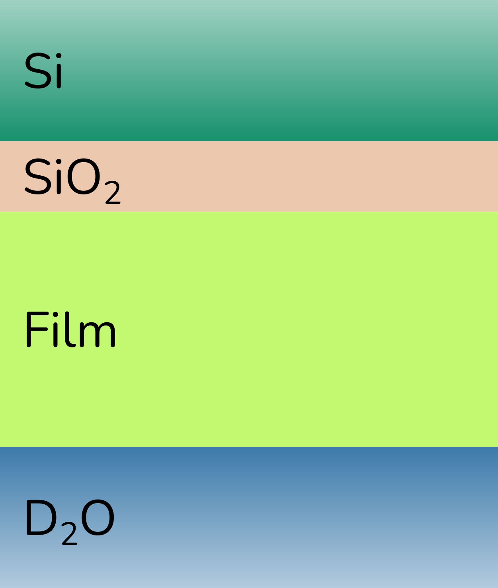
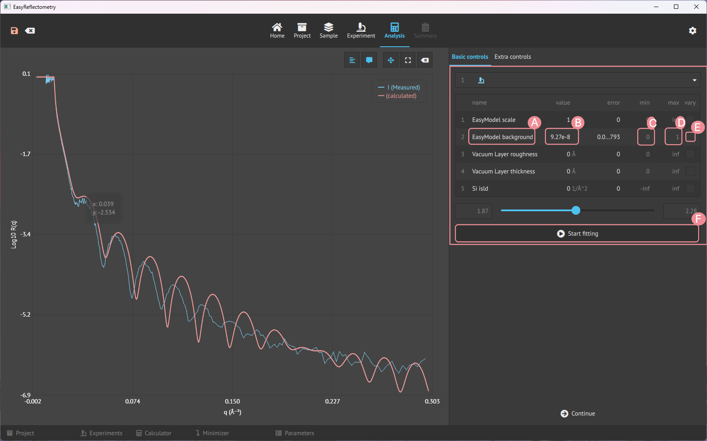
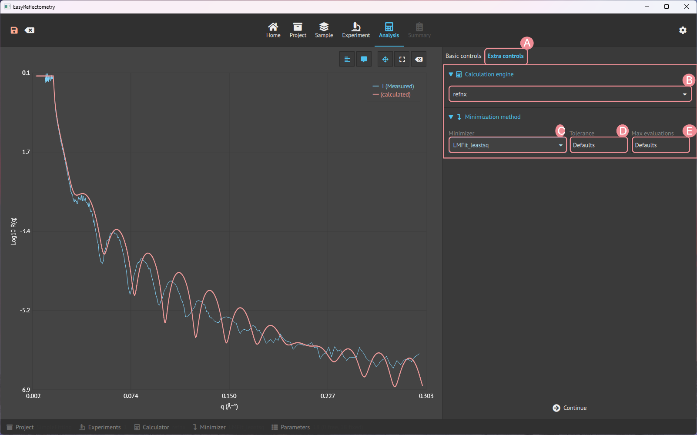

# Simple fitting with a slab model
For this purpose, we have created a simple slab model which is discussed in detail in the [model-dependent analysis](https://www.reflectometry.org/isis_school/2_model_dependent_analysis/what_is_model_dependent_analysis.html) and [reflectometry slab models](https://www.reflectometry.org/isis_school/3_reflectometry_slab_models/the_slab_model.html) sections of the ISIS Virtual Reflectometry Training Course on [neutron reflectometry fitting](https://www.reflectometry.org/isis_school/intro.html). 

The system that we are investigating consists of four layers (with the top and bottom as semi-finite super- and sub-phases). 
The super-phase (where the neutrons are incident first) is a silicon (Si) wafer and as a process of the sample preparation, there is anticipated to be a layer of silicon dioxide (SiO2) on this material.
Then a polymer film is attached to the silicon dioxide by some chemical method and this polymer film is solvated in heavy water (D2O) which also makes up the sub-phase of the system. 
This is shown pictorially below, as a slab model. 

Now for explaining the `Analysis` tab let's look at how the EasyReflectometryApp can fit. The tab is like the previous tabs split into two windows, a graph- and a data-window. 
The graph window has the same functionality as the previous tabs, so it will not be explained further. The data window has two categories: `Basic` and `Advanced` controls.

## Basic controls 
The basic controls is for fitting the variables.

- **A**: Picking the desired variable to use the slider for fine-tuning it.
- **B**: Able to change the specific variable.
- **C**: Setting the minimum variable for fitting.
- **D**: Setting the maximum variable for fitting.
- **E**: Choose the variable for fitting.
- **F**: Fit the chosen variable (**E**) between the min. (**C**) and max. (**D**).

## Advanced controls
The advanced control is then for changing the calculation engine and setting the minimisation method.

- **A**: Changing the calculation engine between `refnx` and `refl1d`.  
- **B**: Setting the minimisation method for minimising variables.
- **C**: Specifying the tolerance of the set minimiser.
- **D**: Setting the maximum number of iterations(evaluations) for the minimiser to run.
