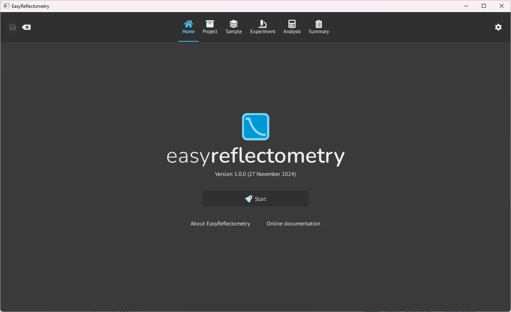

# Getting started
This is the tutorial for getting started with EasyReflectometryApp and how to use it.\\

## Home page
When opening up the EasyRecletometryApp you are presented with the home page.

From here you initialize the programs by hitting **Start**.\\
You can also go to the developer documentation with **Online documentation** and get the source information with **about**.

## Intialize project

