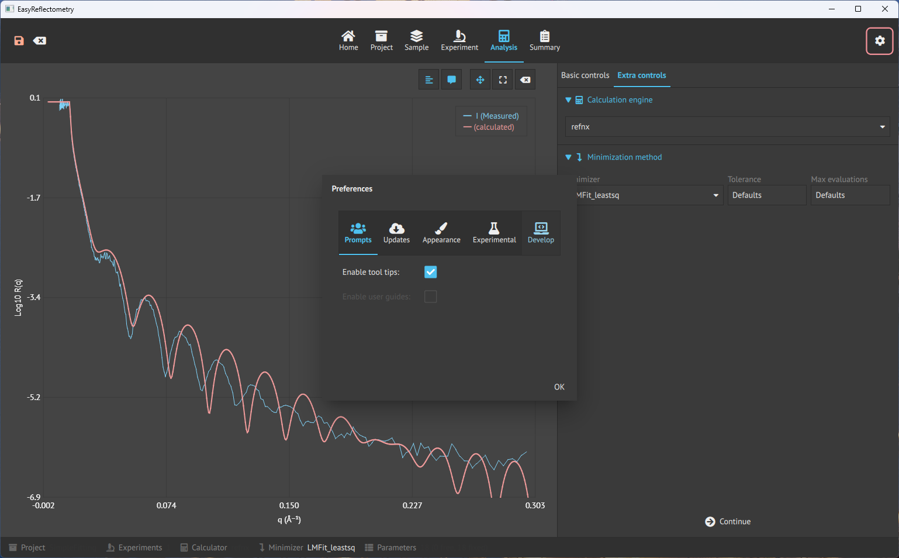

# Settings
The settings can be reached from all tabs by pressing the cogs icon the the top right corner.

In the settings menu, there are five tabs:
## Prompts
Used for enabling/disabling tooltips.

## Updates
Allowing the app to check for updates when starting and force-checking for updates.

## Appearance
Change the theme of the app between: Light, Dark and system mode.

## Experimental
Setting the overall zoom level of icons and buttons, and changing the language of the app (to be implemented).

## Develop
Is for setting how the app will log errors.
